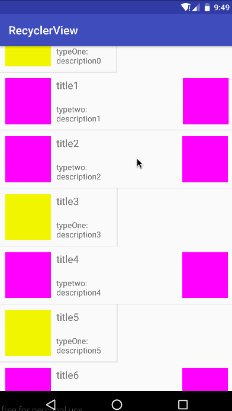

## RecyclerView下拉刷新、上拉加载更多以及复杂列表布局的实现

### 介绍：关于recyclerView大家一定不陌生，可以实现listView，gridView，瀑布流的功能，高度的解耦，异常的灵活，通过设置它提供的不同LayoutManager，ItemDecoration , ItemAnimator实现令人瞠目的效果。

### 本文主要介绍的内容如下：
  * 对recyclerView的适配器封装一些通用方法
  * 实现recyclerView的下拉刷新以及上拉加载更多（当然也是可以关闭的）
  * 优雅实现recyclerView复杂列表布局（ps：部分数据一列加载，部分数据两列加载等等）

> 当然，如果你对recyclerView不怎么了解的话，建议先看看鸿洋的博客[Android RecyclerView 使用完全解析 体验艺术般的控件](http://blog.csdn.net/lmj623565791/article/details/45059587)，他介绍的非常详细了，只不过在这里我做了一些补充

### 先看下效果图：



#### 简单的介绍一下效果图，可以看到布局显示中，有的是黄色方块，有的是红色方块，这是两种不同的布局。我让红色方块一整行显示，而黄色方块半行显示。实际上就是根据数据类型的不同，来以特定的方式展示。这里如果需要加一个头部信息（类似联系人列表的那种）都是同理的。

#### 下面开始介绍代码的实现过程：

##### step1：封装recyclerView的适配器，即`RecyclerViewAdapter`。实际上就是封装了Adapter基类,实现一些最常用的方法，避免重复造轮子。代码如下：
##### RecyclerViewAdapter
```
/**
 * Created by imSunLight on 2016/12/26.
 * 邮箱:1944633835@qq.com
 */
public abstract class RecyclerViewAdapter<T> extends RecyclerView.Adapter<RecyclerView.ViewHolder> {

    protected Context mContext;
    protected LayoutInflater mInflater;
    private int preSize = 0;
    //判断需不需要上拉加载更多
    private boolean isLoadingMore = false;

    //点击事件回调监听
    private RecyclerViewCallback<T> mRecyclerViewCallback;


    protected List<T> mData = new ArrayList<>();

    public RecyclerViewAdapter(Context context) {
        mContext = context;
        mInflater = LayoutInflater.from(mContext);
    }


    @Override
    public int getItemCount() {

        //根据是否下拉加载更多来决定数据的大小
        if (isLoadingMore()) {
            return mData.size() + 1;
        }
        return mData.size();
    }

    public RecyclerViewCallback<T> getRecyclerViewCallback() {
        return mRecyclerViewCallback;
    }

    public void setRecyclerViewCallback(RecyclerViewCallback recyclerViewCallback) {
        this.mRecyclerViewCallback = recyclerViewCallback;
    }

    public boolean isLoadingMore() {
        return isLoadingMore;
    }


    public void setLoadingMore(boolean loadingMore) {
        isLoadingMore = loadingMore;
    }

    /**
     * 设置数据
     *
     * @param list
     */
    public void setData(List<T> list) {
        mData.addAll(list);
        preSize = mData.size();
    }

    /**
     * 设置数据源
     *
     * @param data
     */
    public void setData(T[] data) {
        if (data != null && data.length > 0) {
            setData(Arrays.asList(data));
        }
    }

    /**
     * 添加数据
     *
     * @param data
     */
    public void addData(List<T> data) {
        int preSize = this.mData.size();
        if (data != null && data.size() > 0) {
            if (this.mData == null) {
                this.mData = new ArrayList<T>();
            }
            this.mData.addAll(data);
            notifyItemRangeInserted(preSize, this.mData.size());
        }
        notifyDataSetChanged();
    }

    /**
     * 添加数据
     *
     * @param data
     */
    public void addData(T[] data) {
        addData(Arrays.asList(data));
    }

    /**
     * 删除元素
     *
     * @param element
     */
    public void removeElement(T element) {
        if (mData.contains(element)) {
            int position = mData.indexOf(element);
            mData.remove(element);
            notifyItemRemoved(position);
            notifyItemChanged(position);
        }
    }

    /**
     * 删除元素
     *
     * @param position
     */
    public void removeElement(int position) {
        if (mData != null && mData.size() > position) {
            mData.remove(position);
            notifyItemRemoved(position);
            notifyItemChanged(position);
        }
    }

    /**
     * 删除元素
     *
     * @param elements
     */
    public void removeElements(List<T> elements) {
        if (mData != null && elements != null && elements.size() > 0
                && mData.size() >= elements.size()) {

            for (T element : elements) {
                if (mData.contains(element)) {
                    mData.remove(element);
                }
            }

            notifyDataSetChanged();
        }
    }

    /**
     * 删除元素
     *
     * @param elements
     */
    public void removeElements(T[] elements) {
        if (elements != null && elements.length > 0) {
            removeElements(Arrays.asList(elements));
        }
    }

    /**
     * 更新元素
     *
     * @param element
     * @param position
     */
    public void updateElement(T element, int position) {
        if (position >= 0 && mData.size() > position) {
            mData.remove(position);
            mData.add(position, element);
            notifyItemChanged(position);
        }
    }

    /**
     * 添加元素
     *
     * @param element
     */
    public void addElement(T element) {
        if (element != null) {
            if (this.mData == null) {
                this.mData = new ArrayList<T>();
            }
            mData.add(element);
            notifyItemInserted(this.mData.size());
        }
    }

    public void addElement(int position, T element) {
        if (element != null) {
            if (this.mData == null) {
                this.mData = new ArrayList<T>();
            }
            mData.add(position, element);
            notifyItemInserted(position);
        }
    }

    /**
     * 清除数据源
     */
    public void clearData() {
        if (this.mData != null) {
            this.mData.clear();
            notifyDataSetChanged();
        }
    }


    /**
     * 设置控件可见
     *
     * @param view
     */
    protected void setVisible(View view) {
        view.setVisibility(View.VISIBLE);
    }

    /**
     * 设置控件不可见
     *
     * @param view
     */
    protected void setGone(View view) {
        view.setVisibility(View.GONE);
    }

    /**
     * 设置控件不可见
     *
     * @param view
     */
    protected void setInvisible(View view) {
        view.setVisibility(View.INVISIBLE);
    }

    /**
     * 设置控件可用
     *
     * @param view
     */
    protected void setEnable(View view) {
        view.setEnabled(true);
    }

    /**
     * 设置控件不可用
     *
     * @param view
     */
    protected void setDisable(View view) {
        view.setEnabled(false);
    }

    /**
     * 获取图片资源
     *
     * @param resId
     * @return
     */
    protected Drawable getDrawable(int resId) {
        return mContext.getResources().getDrawable(resId);
    }

    /**
     * 获取字符串资源
     *
     * @param resId
     * @return
     */
    protected String getString(int resId) {
        return mContext.getResources().getString(resId);
    }

    /**
     * 获取颜色资源
     *
     * @param resId
     * @return
     */
    protected int getColor(int resId) {
        return mContext.getResources().getColor(resId);
    }

    /**
     * 获取数据源
     *
     * @return
     */
    public List<T> getDataSource() {
        return mData;
    }

}

```

> 根据适配器的异同来封装总结了通用型的RecyclerViewAdapter（一般来说不同点就是传入的javaBean类吧，所以用泛型类T表示），对此我对适配器做了增删改查方法等一系列封装。当然这里还可以做更多扩展，其实就是Adapter的基类，暂时就封装这么多，以后在慢慢增加。
有个地方需要说明一下:
```
    @Override
     public int getItemCount() {
         //根据是否下拉加载更多来决定数据的大小
         if (isLoadingMore()) {
             return mData.size() + 1;
         }
         return mData.size();
     }
```
在getItemCount()这个方法，要根据是否要添加下拉加载这个模块，如果添加下拉加载更多，那么应该返回的数量大小应该是在mData.size() + 1吧(因为如果要上拉加载更多，那么肯定会多一个item数量的，所以要加1)。否则的话，就是返回mData.size() 就可以了。


#### 这只是个抽象类，具体到我们这个情景就是写个适配器来继承RecyclerViewAdapter了，在个demo里呢，我写了一个`SimpleAdapter`来继承RecyclerViewAdapter<DataModel>,这里的数据类型是DataModel，当然这个类应该是根据实际业务需求来确定，一般是根据从服务端获取到的数据来确定
#### step2：实现DataModel
```
/**
 * Created by imSunLight on 2016/12/26.
 * 邮箱:1944633835@qq.com
 */
public class DataModel {

    public  static   final  int  TYPE_ONE=1;
    public static    final  int TYPE_TWO=2;

    private  int dataType;

    private  String title;
    private String descreption;

    public DataModel(String title, String descreption, int dataType) {
        this.title = title;
        this.descreption = descreption;
        this.dataType = dataType;
    }

    public int getDataType() {
        return dataType;
    }

    public void setDataType(int dataType) {
        this.dataType = dataType;
    }

    public String getTitle() {
        return title;
    }

    public void setTitle(String title) {
        this.title = title;
    }

    public String getDescreption() {
        return descreption;
    }

    public void setDescreption(String descreption) {
        this.descreption = descreption;
    }

    @Override
    public String toString() {
        return "DataModel{" +
                "TYPE_ONE=" + TYPE_ONE +
                ", TYPE_TWO=" + TYPE_TWO +
                ", dataType=" + dataType +
                ", title='" + title + '\'' +
                ", descreption='" + descreption + '\'' +
                '}';
    }
}
```
> 说明：正如一开始的效果图所示，有黄色方块跟红色方块，分别代表了两种数据类型，所以在DataModel这个类中创建了一个`int dataType`属性。

#### step3：实现SimpleAdapter
```
/**
 * Created by gechuanguang on 2016/12/28.
 * 邮箱：1944633835@qq.com
 */

public class SimpleAdapter extends RecyclerViewAdapter<DataModel> {

    public static final int TYPE_FOOTER = 1003;

    public static  final  int STATE_LOADINGMORE=100120;
    public static  final  int STATE_NOMOREDATA=100121;

    private int Loadingstate=STATE_LOADINGMORE;

    public SimpleAdapter(Context context) {
        super(context);
        Loadingmore(true);
    }

    @Override
    public int getItemViewType(int position) {
        super.getItemViewType(position);
        if (position == mData.size()) {
            //说明加载到最底部了  -->显示底部布局
            return TYPE_FOOTER;
        }
        //不是底部，那么必然是内容区域布局了
        DataModel dataModel = mData.get(position);
        int dataType = dataModel.getDataType();
        if (dataType == DataModel.TYPE_ONE) {
            return DataModel.TYPE_ONE;
        }
        return DataModel.TYPE_TWO;
    }

    @Override
    public RecyclerView.ViewHolder onCreateViewHolder(ViewGroup parent, int viewType) {
        View view = null;
        ItemHolder itemHolder = null;
        switch (viewType) {
            case DataModel.TYPE_ONE:
                view = mInflater.inflate(R.layout.item_typeone, parent, false);
                itemHolder = new ItemHolder(view,DataModel.TYPE_ONE);
                break;
            case DataModel.TYPE_TWO:
                view = mInflater.inflate(R.layout.item_typetwo, parent, false);
                itemHolder = new ItemHolder(view,DataModel.TYPE_TWO);
                break;
            case TYPE_FOOTER:
                view = mInflater.inflate(R.layout.footer, parent, false);
                itemHolder = new ItemHolder(view,TYPE_FOOTER);
                break;
        }
        return itemHolder;
    }

    @Override
    public void onBindViewHolder(RecyclerView.ViewHolder holder, final int position) {

        //首先要判断是不是底部布局
        final int itemViewType = getItemViewType(position);
        if (itemViewType == TYPE_FOOTER) {
            String tips = "";
            if (Loadingstate==STATE_LOADINGMORE) {
                tips = "加载更多...";
            } else if(Loadingstate==STATE_NOMOREDATA){
                tips = "没有更多数据！！！";
            }
            ((ItemHolder) holder).showTips.setText(tips);
            return;
        }

        //内容区域布局
        final DataModel dataMode = mData.get(position);

        if (itemViewType == DataModel.TYPE_ONE) {
            ((ItemHolder) holder).title.setText(dataMode.getTitle() );
            ((ItemHolder) holder).description.setText("typeOne:\n" + dataMode.getDescreption());
            ((ItemHolder) holder).mImageView.setBackgroundColor(Color.parseColor("#f3f33f"));
        } else {
            ((ItemHolder) holder).title.setText(dataMode.getTitle() );
            ((ItemHolder) holder).description.setText("typetwo:\n" + dataMode.getDescreption());
            ((ItemHolder) holder).mImageView.setBackgroundColor(Color.parseColor("#ff22ff"));
            ((ItemHolder) holder).mImageView2.setBackgroundColor(Color.parseColor("#ff22ff"));
        }
        //点击事件
        holder.itemView.setOnClickListener(new View.OnClickListener() {
            @Override
            public void onClick(View view) {
                if (getRecyclerViewCallback() != null) {
                    getRecyclerViewCallback().OnItemClickListener(position, dataMode, itemViewType);
                }
            }
        });
        //长按事件
        holder.itemView.setOnLongClickListener(new View.OnLongClickListener() {
            @Override
            public boolean onLongClick(View view) {
                if (getRecyclerViewCallback() != null) {
                    getRecyclerViewCallback().OnItemLongClickListener(position, dataMode, itemViewType);
                }
                return true;
            }
        });
    }

    /**
     *  上拉加载开关
     * @param isLoadingmore  true：上拉加载， false：关闭加载(并且隐藏了底部布局)
     */
    public void Loadingmore(boolean isLoadingmore) {
        if(isLoadingmore){
            setLoadingMore(isLoadingmore);
            Loadingstate=STATE_LOADINGMORE;
            this.notifyDataSetChanged();
        }

    }

    /**
     * 没有更多数据加载
     */
    public void LoadIngNoMoreData(){

        Loadingmore(true);
        this.Loadingstate=STATE_NOMOREDATA;
        this.notifyDataSetChanged();
    }
}
```
#### 下面开始介绍SimpleAdapter这个类一些主要方法：

* 首先是getItemViewType()这个方法
```
   @Override
    public int getItemViewType(int position) {
        super.getItemViewType(position);
        if (position == mData.size()) {
            //说明加载到最底部了  -->显示底部布局
            return TYPE_FOOTER;
        }
        //不是底部，那么必然是内容区域布局了
        DataModel dataModel = mData.get(position);
        int dataType = dataModel.getDataType();
        if (dataType == DataModel.TYPE_ONE) {
            return DataModel.TYPE_ONE;
        }
        return DataModel.TYPE_TWO;
    }
```
> 根据position判断是不是滑到最后一个元素了，如果是的，那么就是显示底部布局，即返回一个int类型的标志；否则的话，就要根据position来判断要加载的数据类型，然后返回不同的int类型标志。

* 其次是onCreateViewHolder()方法，即创建一个ViewHolder
```
 @Override
    public RecyclerView.ViewHolder onCreateViewHolder(ViewGroup parent, int viewType) {
        View view = null;
        ItemHolder itemHolder = null;
        switch (viewType) {
            case DataModel.TYPE_ONE:
                view = mInflater.inflate(R.layout.item_typeone, parent, false);
                itemHolder = new ItemHolder(view,DataModel.TYPE_ONE);
                break;
            case DataModel.TYPE_TWO:
                view = mInflater.inflate(R.layout.item_typetwo, parent, false);
                itemHolder = new ItemHolder(view,DataModel.TYPE_TWO);
                break;
            case TYPE_FOOTER:
                view = mInflater.inflate(R.layout.footer, parent, false);
                itemHolder = new ItemHolder(view,TYPE_FOOTER);
                break;
        }
        return itemHolder;
    }
```
> 那么这个ItemHolder哪里来的呢，其实要我是把这一块抽离出来了（不然怎么说是优雅实现recyclerView复杂列表布局呢）。我是先创建了一个BaseViewHolder，然后ItemHolder来继承BaseViewHolder

#### `BaseViewHoler`实现如下：
```
/**
 * Created by gechuanguang on 2016/12/26.
 * 邮箱：1944633835@qq.com
 */

public abstract  class BaseViewHolder extends RecyclerView.ViewHolder {

    public BaseViewHolder(View itemView,int viewType) {
        super(itemView);

        if(viewType== DataModel.TYPE_ONE){
            initTypeOneLayout(itemView);
        }
        if(viewType==DataModel.TYPE_TWO){
            initTypeTwoLayout(itemView);
        }
        if(viewType== SimpleAdapter.TYPE_FOOTER){
            initTypeFooterlayout(itemView);
        }

    }

    abstract void initTypeOneLayout(View itemView);
    abstract void initTypeTwoLayout(View itemView);
    abstract void initTypeFooterlayout(View itemView);

}
```
> 在构造方法中传一个viewType，来确定我们要初始化哪些控件。这是一个抽象类，我们需要一个具体的ItemHolder来继承它

#### `ItemHolder`实现如下：

```
public class ItemHolder extends BaseViewHolder {
    public TextView title;
    public TextView description;
    public ImageView mImageView;
    public ImageView mImageView2;
    //底部布局
    public  TextView showTips;

    public ItemHolder(View itemView,int viewType) {
        super(itemView,viewType);
    }

    @Override
    void initTypeOneLayout(View itemView) {
        title = (TextView) itemView.findViewById(R.id.title);
        description = (TextView) itemView.findViewById(R.id.des);
        mImageView = (ImageView) itemView.findViewById(R.id.img);
    }

    @Override
    void initTypeTwoLayout(View itemView) {
        title = (TextView) itemView.findViewById(R.id.title);
        description = (TextView) itemView.findViewById(R.id.des);
        mImageView = (ImageView) itemView.findViewById(R.id.img);
        mImageView2 = (ImageView) itemView.findViewById(R.id.img2);
    }

    @Override
    void initTypeFooterlayout(View view) {
        showTips= (TextView) view.findViewById(R.id.tv_showTips);
    }
}
```

#### ok,ItemHolder已经实现了，回归到上面onCreateViewHolder()这个方法，根据viewType来创建ItemHolder。

* 再其次就是onBindViewHolder(RecyclerView.ViewHolder holder, final int position)这个方法，在这里就要填充对应的数据了
```
    @Override
    public void onBindViewHolder(RecyclerView.ViewHolder holder, final int position) {

        //首先要判断是不是底部布局
        final int itemViewType = getItemViewType(position);
        if (itemViewType == TYPE_FOOTER) {
            String tips = "";
            if (Loadingstate==STATE_LOADINGMORE) {
                tips = "加载更多...";
            } else if(Loadingstate==STATE_NOMOREDATA){
                tips = "没有更多数据！！！";
            }
            ((ItemHolder) holder).showTips.setText(tips);
            return;
        }

        //内容区域布局
        final DataModel dataMode = mData.get(position);

        if (itemViewType == DataModel.TYPE_ONE) {
            ((ItemHolder) holder).title.setText(dataMode.getTitle() );
            ((ItemHolder) holder).description.setText("typeOne:\n" + dataMode.getDescreption());
            ((ItemHolder) holder).mImageView.setBackgroundColor(Color.parseColor("#f3f33f"));
        } else {
            ((ItemHolder) holder).title.setText(dataMode.getTitle() );
            ((ItemHolder) holder).description.setText("typetwo:\n" + dataMode.getDescreption());
            ((ItemHolder) holder).mImageView.setBackgroundColor(Color.parseColor("#ff22ff"));
            ((ItemHolder) holder).mImageView2.setBackgroundColor(Color.parseColor("#ff22ff"));
        }
        //点击事件
        holder.itemView.setOnClickListener(new View.OnClickListener() {
            @Override
            public void onClick(View view) {
                if (getRecyclerViewCallback() != null) {
                    getRecyclerViewCallback().OnItemClickListener(position, dataMode, itemViewType);
                }
            }
        });
        //长按事件
        holder.itemView.setOnLongClickListener(new View.OnLongClickListener() {
            @Override
            public boolean onLongClick(View view) {
                if (getRecyclerViewCallback() != null) {
                    getRecyclerViewCallback().OnItemLongClickListener(position, dataMode, itemViewType);
                }
                return true;

        });
    }
```
> 简单介绍一下这个方法做了哪些逻辑的处理，首先判断我们加载的是不是底部布局，并且根据Loadingstate来决定底部加载框的提示内容（加载更多or没有更多数据）；如果是内容区域的话，就填充对应的数据。其次是点击事件，我们知道RecyclerView是没有给我们提供点击事件的，所以这个得自己实现，方法也很简单，就是定义一个接口，通过接口回调的方式得到对应的position已经其他数据。
定义的回调接口如下：

```
/**
 * Created by gechuanguang on 2016/12/28.
 * 邮箱：1944633835@qq.com
 */

public interface RecyclerViewCallback<T> {

    /**
     * recyclerView点击事件回调
     *
     * @param position  位置
     * @param dataModel 对应的实体类
     * @param flag      布局的类型
     */
    void OnItemClickListener(int position, T dataModel, int flag);

    /**
     * recyclerView 长按事件回调
     *
     * @param position  位置
     * @param dataModel 对应的实体类
     * @param flag      布局的类型
     */
    void OnItemLongClickListener(int position, T dataModel, int flag);
}
```
* 还有最后一个就是上拉加载更多的设置
```
    /**
     *  上拉加载开关
     * @param isLoadingmore  true：上拉加载， false：关闭加载(并且隐藏了底部布局)
     */
    public void Loadingmore(boolean isLoadingmore) {
        if(isLoadingmore){
            setLoadingMore(isLoadingmore);
            Loadingstate=STATE_LOADINGMORE;
            this.notifyDataSetChanged();
        }

    }

    /**
     * 没有更多数据加载
     */
    public void LoadIngNoMoreData(){

        Loadingmore(true);
        this.Loadingstate=STATE_NOMOREDATA;
        this.notifyDataSetChanged();
    }
}
```
> 因为有时候我们是不需要有上拉加载更多的，为了灵活性，得在这里设置是否开启的加载的开关，即`Loadingmore(boolean isLoadingmore)`这个方法，通过传入`true`or`false`，来决定底部布局是否显示。如果开启上拉加载更多并且没有更多数据了，这个也该有个提示吧，so，定义了`LoadIngNoMoreData()`这个方法，来提示没有更多数据要加载了

####  到此为止，核心的东西差不多都介绍完了，接下来看看在Activity或者Fragment中怎么去使用RecyclerView吧

`MainActivity`的实现：

```

public class MainActivity extends AppCompatActivity implements SwipeRefreshLayout.OnRefreshListener {

    private RecyclerView mRecyclerView;
    private SimpleAdapter mAdapter;
    private Context mContext = this;
    private List<DataModel> mList = new ArrayList<>();
    private GridLayoutManager mLayoutManager;
    private SwipeRefreshLayout mSwipeRefreshLayout;


    @Override
    protected void onCreate(Bundle savedInstanceState) {
        super.onCreate(savedInstanceState);
        setContentView(R.layout.activity_main);

        initView();

        //设置刷新回调
        mSwipeRefreshLayout.setOnRefreshListener(this);
        mSwipeRefreshLayout.setColorSchemeResources(R.color.colorPrimaryDark,
                R.color.colorAccent, R.color.colorPrimary, R.color.colorAccent);

        mRecyclerView.addItemDecoration(new DividerGridItemDecoration(mContext));
        mAdapter = new SimpleAdapter(mContext);
        mLayoutManager = new GridLayoutManager(mContext, 2);
        //动态控制显示列数
        mLayoutManager.setSpanSizeLookup(new GridLayoutManager.SpanSizeLookup() {
            @Override
            public int getSpanSize(int position) {
                int itemViewType = mAdapter.getItemViewType(position);
                if (itemViewType == DataModel.TYPE_ONE) {
                    return 1;
                } else {
                    return 2;
                }
            }
        });
        mRecyclerView.setLayoutManager(mLayoutManager);
        mRecyclerView.setAdapter(mAdapter);

        initData();
        initListener();
        mRecyclerView.addOnScrollListener(mOnScrollListener);


//        mSwipeRefreshLayout.setEnabled(false);

    }

    RecyclerView.OnScrollListener mOnScrollListener = new RecyclerView.OnScrollListener() {
        int lastVisibleItemPosition = 0;

        @Override
        public void onScrollStateChanged(RecyclerView recyclerView, int newState) {
            super.onScrollStateChanged(recyclerView, newState);
            if (newState == RecyclerView.SCROLL_STATE_IDLE && lastVisibleItemPosition + 1 == mAdapter.getItemCount()) {
                /**--此处要做的是从后台请求数据，判断是否有更多数据要加载--**/
                boolean hasmoreData = true;//实际情况——>根据后台返回的json的某个字段判断
                if (hasmoreData) {
                    //开启下拉加载
                    mAdapter.Loadingmore(true);
                    //此处实际开发中，应该是从后台请求下一页的数据
                    //模仿 添加一些测试数据

                    List<DataModel> moreData = new ArrayList<>();
                    for (int i = 0; i < 5; i++) {
                        moreData.add(new DataModel("下拉刷新:" + i, "des" + i, DataModel.TYPE_TWO));
                    }
                    mAdapter.addData(moreData);
                    return;
                }

                //没有更多数据---> 此处根据需求来做，当没有更多数据的时候是隐藏底部布局，还是显示底部布局，并且提示没更多数据
                mAdapter.LoadIngNoMoreData();
            }
        }

        @Override
        public void onScrolled(RecyclerView recyclerView, int dx, int dy) {
            super.onScrolled(recyclerView, dx, dy);
            lastVisibleItemPosition = mLayoutManager.findLastVisibleItemPosition();
        }
    };

    private void initListener() {
        //点击事件
        mAdapter.setRecyclerViewCallback(new RecyclerViewCallback() {
            @Override
            public void OnItemClickListener(int position, Object dataModel, int flag) {
                Toast.makeText(mContext, "点击了：" + position, Toast.LENGTH_SHORT).show();
            }

            @Override
            public void OnItemLongClickListener(int position, Object dataModel, int flag) {
                Toast.makeText(mContext, "长按了" + position, Toast.LENGTH_SHORT).show();
            }
        });
    }

    private void initView() {
        mSwipeRefreshLayout = (SwipeRefreshLayout) findViewById(R.id.swipeLayout);
        mRecyclerView = (RecyclerView) findViewById(R.id.rl);
    }

    private void initData() {
        //模拟一些list数据
        for (int i = 0; i < 15; i++) {
            DataModel model;
            double random = Math.random();
            if (random < 0.5) {
                model = new DataModel("title" + i, "description" + i, DataModel.TYPE_ONE);
            } else {
                model = new DataModel("title" + i, "description" + i, DataModel.TYPE_TWO);
            }
            mList.add(model);
        }
        mAdapter.setData(mList);
    }


    //下拉刷新
    @Override
    public void onRefresh() {
        //重新刷新 加载  (既然是刷新，就应该把之前的数据集都清除掉，再重新请求)
        mAdapter.clearData();

        //伪造一些数据，实际情况应该在此处从后台请求最新的20条数据（条数按实际情况确定）
        List<DataModel> list = new ArrayList<>();
        for (int i = 0; i < 20; i++) {
            list.add(new DataModel("title:刷新的数据" + i, "des:刷新的数据" + i, DataModel.TYPE_TWO));
        }
        mAdapter.addData(list);
        mSwipeRefreshLayout.setRefreshing(false);
    }
}
```
> 在MainActivity中实现了下拉刷新，上拉加载更多，以及数据的初始化操作。下拉刷新很简单，只要在RecyclerView外面包裹一个SwipeRefreshLayout就可以了。

#### activity_main.xml实现如下；
```
<?xml version="1.0" encoding="utf-8"?>
<android.support.v4.widget.SwipeRefreshLayout
    android:id="@+id/swipeLayout"
    xmlns:android="http://schemas.android.com/apk/res/android"
    xmlns:tools="http://schemas.android.com/tools"
    android:layout_width="match_parent"
    android:layout_height="match_parent"
    tools:context=".MainActivity">

   <android.support.v7.widget.RecyclerView
       android:id="@+id/rl"
       android:layout_width="match_parent"
       android:layout_height="match_parent" />

</android.support.v4.widget.SwipeRefreshLayout>
```

#### 接下来介绍一下MainActivity里面的一些实现过程，主要以下几点：
* 下拉刷新
   >要实现下拉刷新，就要给SwipeRefreshLayou设置下拉监听，即mSwipeRefreshLayout.setOnRefreshListener(this);紧接着就会回调onRefresh()这个方法给我们，执行了这个方法就说明我们刷新了，我想说的是，一旦刷新我们就要把以前的数据集都清除调，然后再传给适配器吧，即首先要mAdapter.clearData();然后在add新的数据。如果不想添加下拉刷新了，就不想改变xml布局，那么也可以mSwipeRefreshLayout.setEnabled(false);不让它刷新

* 填充复杂列表布局
   >如何动态的设置，让某些数据一行显示而让另一些数据半行显示呢，其实就是`mLayoutManager.setSpanSizeLookup(）`实现。

   ```
     mLayoutManager = new GridLayoutManager(mContext, 2);
           //动态控制显示列数
           mLayoutManager.setSpanSizeLookup(new GridLayoutManager.SpanSizeLookup() {
               @Override
               public int getSpanSize(int position) {
                   int itemViewType = mAdapter.getItemViewType(position);
                   if (itemViewType == DataModel.TYPE_ONE) {
                       return 1;
                   } else {
                       return 2;
                   }
               }
           });
   ```
  #### 注意：当retrun 1的时候，就是每个item占据1／2行，当return 2的时候，就是每个item占据2／2行。

* 上拉加载更多
  >主要给RecyclerView设置mRecyclerView.addOnScrollListener(mOnScrollListener);

#### mOnScrollListener对象如下：

```
  RecyclerView.OnScrollListener mOnScrollListener = new RecyclerView.OnScrollListener() {
        int lastVisibleItemPosition = 0;

        @Override
        public void onScrollStateChanged(RecyclerView recyclerView, int newState) {
            super.onScrollStateChanged(recyclerView, newState);
            if (newState == RecyclerView.SCROLL_STATE_IDLE && lastVisibleItemPosition + 1 == mAdapter.getItemCount()) {
                /**--此处要做的是从后台请求数据，判断是否有更多数据要加载--**/
                boolean hasmoreData = true;//实际情况——>根据后台返回的json的某个字段判断
                if (hasmoreData) {
                    //开启下拉加载
                    mAdapter.Loadingmore(true);
                    //此处实际开发中，应该是从后台请求下一页的数据
                    //模仿 添加一些测试数据

                    List<DataModel> moreData = new ArrayList<>();
                    for (int i = 0; i < 5; i++) {
                        moreData.add(new DataModel("下拉刷新:" + i, "des" + i, DataModel.TYPE_TWO));
                    }
                    mAdapter.addData(moreData);
                    return;
                }

                //没有更多数据---> 此处根据需求来做，当没有更多数据的时候是隐藏底部布局，还是显示底部布局，并且提示没更多数据
                mAdapter.LoadIngNoMoreData();
            }
        }

        @Override
        public void onScrolled(RecyclerView recyclerView, int dx, int dy) {
            super.onScrolled(recyclerView, dx, dy);
            lastVisibleItemPosition = mLayoutManager.findLastVisibleItemPosition();
        }
    };
```
> 其实代码里注释很清楚了，根据后台返回的数据来判断是否有更多数据，如果有那么就要开启下拉加载更多开关，如果没有更多数据了，就调用mAdapter.LoadIngNoMoreData();

#### 好了，关于RecyclerView的下拉刷新，上拉加载更多，以及recyclerView的复杂列表的实现方式已经介绍完了。虽然这只是个demo，但是具体到一个项目中，也能灵活改变的，原理不变。

#### 如果还不是很清楚的，请参考源码Demo


